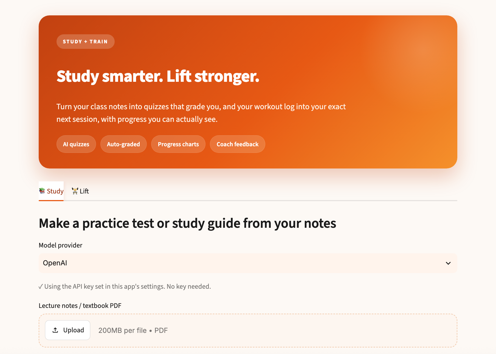

# Coursework & Lift Tracker

A single-user study and fitness assistant: turns class notes into auto-graded
quizzes, and a workout log into your exact next session.

**Live demo:** https://study.fraud-ai-detection.com
&nbsp;·&nbsp; 

<!-- Add a screenshot: take one of the live site, save as docs/screenshot.png. -->
<!--  -->

---

## What it does

**Study tab**
- Generates practice tests and study guides from your notes or a PDF using an
  LLM (OpenAI or Anthropic).
- Five modes: multiple choice, short answer, topic study guide, common mistakes,
  and exam-style questions.
- Auto-grades multiple-choice answers, then re-quizzes you on the ones you
  missed. Export any quiz to CSV (Anki-compatible).

**Lift tab**
- Paste your workout notes; it parses the weights and reps and recommends the
  next session using **double progression** (add reps within a target range,
  then load), with rep ranges defaulted by lift type.
- Saves your history in a database, charts your progress over time, logs
  bodyweight and body fat, estimates your 1-rep-max, flags personal records,
  and can generate AI coach feedback.

## How it works

- Notes and PDFs are parsed (`pypdf`) and sent to the LLM behind a single
  swappable function, so the model provider can be changed easily.
- Workout notes are parsed with regex into an editable table; the progression
  logic is pure Python and unit-tested.
- History and body metrics persist in SQLite (`get_connection` is the one place
  that would change to move to hosted Postgres).

## Tech stack

Python · Streamlit · SQLite · pandas · OpenAI / Anthropic APIs · pytest ·
GitHub Actions (CI). Deployed on an Ubuntu VPS behind Nginx with HTTPS, running
as a systemd service.

## Run locally

```bash
pip install -r requirements.txt
streamlit run app.py
```

To use the quiz features, add an API key: create `.streamlit/secrets.toml` with
`OPENAI_API_KEY = "sk-..."` (or `ANTHROPIC_API_KEY`). The workout side works
without a key.

## Tests

```bash
pip install pytest
pytest -q
```

18 unit tests in `test_app.py` cover parsing, double progression, grading, the
database round-trip, and the prompt builders. CI runs them on every push.

## Rep-range references

Defaults follow standard strength guidance
([NSCA](https://www.ptpioneer.com/personal-training/certifications/nsca-cpt/nsca-cpt-chapter-15/),
[double progression](https://legionathletics.com/double-progression/)).

## Background

The original project write-up is in [PROPOSAL.md](PROPOSAL.md).
